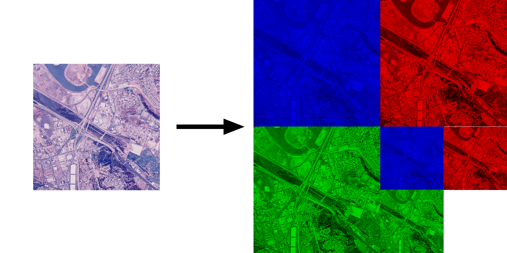

# CUDAImageProcessingAtScale

This is project for course CUDA at Scale for the Enterprise.

## Project Description

This program is intended to create simple biqubic binary MIP-maps for the images.



## How to run

> Flag `log=1` for logging in the console. Default is `log=0`.

```shell
$ make all log=1 ARGS="-f ./myfile.png -o ./mydir/"
```

> You can compile and build 3 different versions. In addition to the standard compilation, there are **debug** and **test** builds for use. For a **test build** use:
>```shell
>$ make all log=1 t=1
>```
> For **debug build** use:
>```shell
>$ make all log=1 dbg=1
>```
> **Test** build will process a lot of images from [database](https://sipi.usc.edu/database/database.php?volume=aerials) and **debug** build will process only one but with png output.

## Arguments

| **argument** | **input_example**          | **default_value** | **meaning**                                                                                                 |
|--------------|----------------------------|-------------------|-------------------------------------------------------------------------------------------------------------|
|      `-f`      | `-f ./data/my_image.tiff`  |         -         | Allows you to process your own file. Can be used many times.                                                |
|      `-o`      |  `-o ./my/path/to/output/` |  `./data/output/` | Set output path for the processed images.                                                                   |
|      `-b`      |           `-b 32`          |        `64`       | Set CUDA block dimension (dim3 block(64/2, 64/2, 1)). The maximum value is 64 due to the CUDA architecture. |

## Example


| **Source**    | INPUT | CPU | CUDA |
|---------------|-------|-----|------|
| **batchSize** |   64  |  32 | 32   |
| **imageSize** |    4096   |  1024   |   1024   |
|  **outImage** |       |     |      |
|  **outMIP** |       |     |      |

## Code organization

`src/` This folder contains source code `.cu` and `.h` files;

`lib/` This folder contains additional includes;

`data/` This folder is used by application as default place of data input/output;

`bin/` This folder contains precompiled example with sha256 checksum. Program is compiled here as the default.

`.debug/` This folder contains results of debug build execution to look at.

## Requirements

1. [`opencv`](https://opencv.org/)
2. [`curl`](https://curl.se/)
